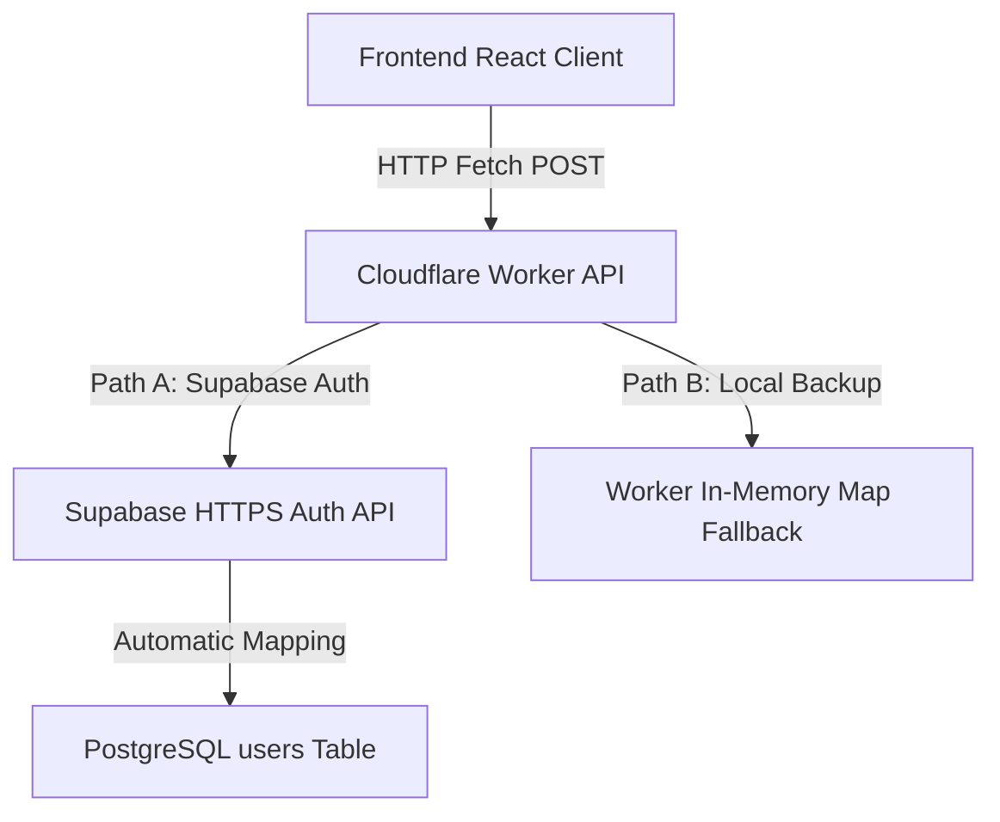

# UniMind Database Overview

This directory contains the database design schemas and PostgreSQL specifications for UniMind's cloud operating system.

## Schema Directory Map
* **[users.sql](file:///c:/Users/Adnan/Desktop/UniMind/database/schema/users.sql)** — PostgreSQL structure for registering and managing user profile attributes, institution links, majors, and index optimization keys.

## Database Integration Architecture

UniMind leverages **Supabase PostgreSQL** as its primary cloud data store. The authentication and data routing operates under a secure dual-pathway architecture:

### 1. Connection Configurations
The database parameters are securely loaded inside wrangler environment scopes through local `.dev.vars` bindings:
* `DATABASE_URL`: Connection string connecting to the Supabase Postgres instance via port `5432` for direct query execution.
* `SUPABASE_URL`: HTTPS API URL endpoint serving as the PostgREST and Auth API router.
* `SUPABASE_ANON_KEY`: Client authorization key allowing secured public REST operations.

### 2. Auto-Trigger Profile Sync
To seamlessly synchronize accounts registered through Supabase Auth into your custom public tables, a database trigger function is defined. It parses the custom `raw_user_meta_data` credentials (Name, Institution, Major, Academic Role) passed during registration and inserts them into the `public.users` table instantly. The trigger definition is located in the [users.sql](file:///c:/Users/Adnan/Desktop/UniMind/database/schema/users.sql) file.
